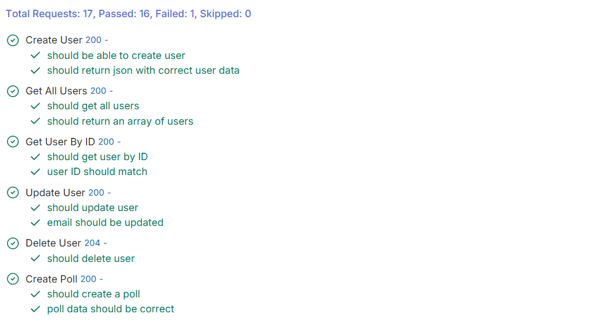
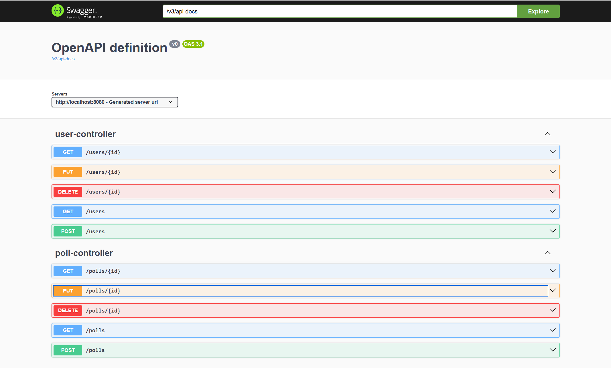

# Basic Spring Boot Application

*Students*: Kamil, Maren, Fredric

*Course*: DAT250 at HVL Bergen - Master Software Engineering 

*Code*: [https://github.com/Maren24/DAT250](https://github.com/Maren24/DAT250)

The first exercise is about creating a first API as a Java Spring Boot application.
For this a first data model was defined, which is extended below.

## Data Model


## Internal structure

For the code structure the Model-View-Controller-Concept was applied. 
The Model defines all classes and data-formats, the view represents the interface to the user with the RestAPI Components and the Controller contains the business logic.

## Testing

The development approach was "Test-Driven". With "Bruno" different API-Request-Files were created and the expected Outputs specified.
After this the code was implemented and tested.

In Bruno it is possible to write automated tests and execute all the different Test-Cases after each other.
This is done with the Bruno Runner feature.



Example test:
```js
test("should be able to create user", function () {
  expect(res.getStatus()).to.equal(200);
});

test("should return json with correct user data", function () {
  const resBody = res.getBody();
  expect(resBody).to.have.property('userId');
  expect(resBody.email).to.equal('john.doe@example.com');
  bru.setVar('userId', resBody.userId);
});
```

## API Requests

A Swagger UI was generated to have a good overview over all the different requests.
The API can be accessed over: [http://localhost:8080/swagger-ui/index.html#/](http://localhost:8080/swagger-ui/index.html#/)




Different CRUD-operations were implemented for the different components.

Users:
- get users
- get user by id
- create user
- delete user
- update user email, password

Poll:
- Create new poll (includes the VoteOption)
- Delete a poll (includes VoteOption and Votes)
- Update validUntil in poll (insecure to change createdBy, createdAt or question)
- Get poll by id
    - If creator requests: Get all information with users
    - If someone else requests: Get only information of user
- Get all polls

Vote:
- Create new vote of User to VoteOption
- Delete vote of User to VoteOption
- Get all votes
- Get vote by id

VoteOption (for testing)
- Create a new voteOption
- Delete a voteOption
- Get all voteOptions
- Get voteOption by id

A few CRUD implementations will not be required in the productive environment. 
E.g. it is not required to request the voteOption or votes separately. 
The requesting of the data will happen (in the API) through the Poll-Interface, which returns all data combined.

The PUT-operations for vote and voteOption are not required. 
It does not make any sense to change a vote, because a vote is more or less a boolean.
Changing the voteOption also makes no sense (logically), because you could manipulate the result.


## Challenges during the work

The main challenges during the task were the following:

- Separating tasks - the entire system is strong connected, which made it hard to separate the tasks between the team members
- Definition of the required model took some time - optimization of business logic
- Find best practice to implement individual Request- or Return-Classes for the models, when other parameter should be returned, than defined by the base-class.