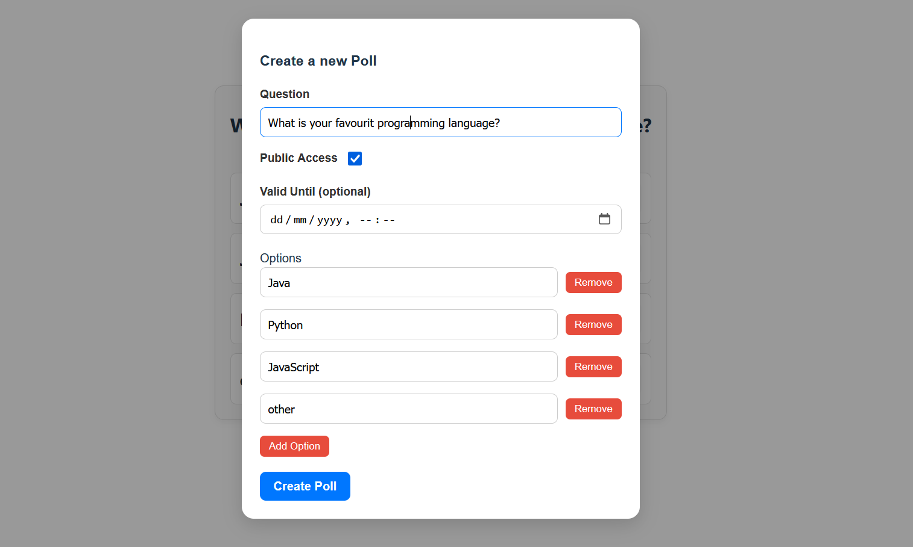
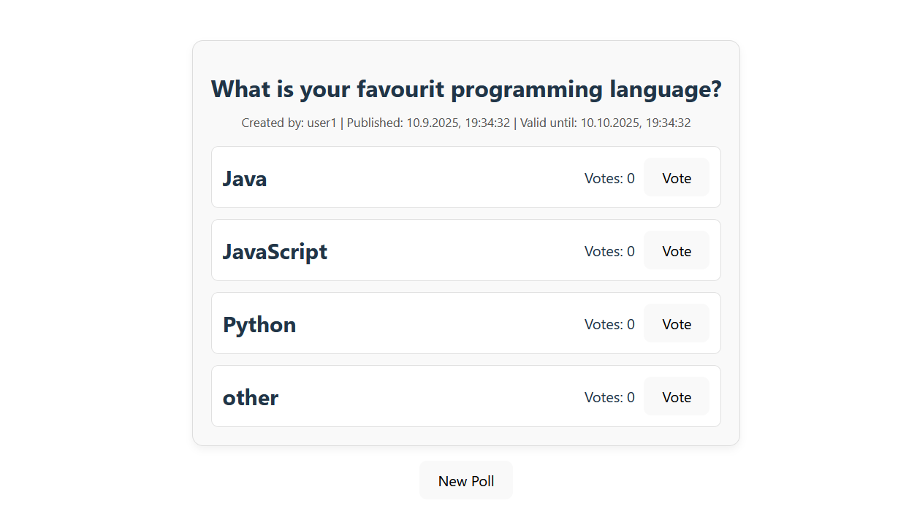

# Single Web Application

*Students*: Kamil, Maren, Fredric

*Course*: DAT250 at HVL Bergen - Master Software Engineering

*Code*: [https://github.com/Maren24/DAT250](https://github.com/Maren24/DAT250)

*Code of task 1 and 2*: [https://github.com/Maren24/DAT250/tree/main/frontend](https://github.com/Maren24/DAT250/tree/main/frontend)

## Setup environment

Create two files in the frontend-folder:
- .env
- .env.production

Write into these files:
```bash
# .env
VITE_API_BASE_URL=http://localhost:8080
```

And in the other:
```bash
# .env.production
VITE_API_BASE_URL=""
```

## Features

Create new Polls:



Overview over polls and possibility to vote:




## Technical Challenges

- Setup environment file: Different from ReactJS approach with "REACT_APP_" naming in Vite. Short part of refactoring
- During the development process a lot of different small issues occured that needed to be fixed in the Backend
  - e.g. missing functionality
  - e.g. CORS
- Challenges: User-Management in the Background: Current solution is to create just a dummy user
  - Check if the user `user1` exists; if not create it