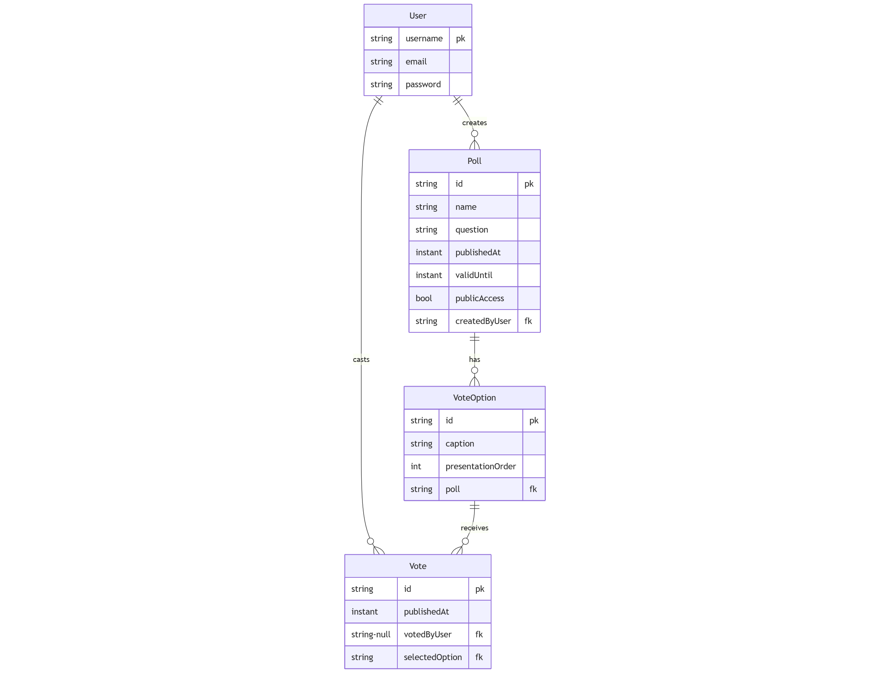
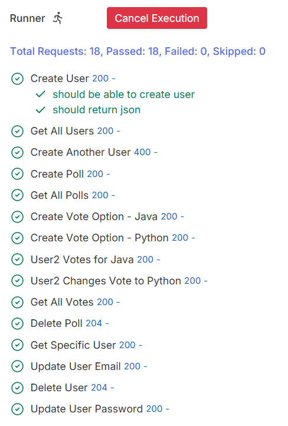

# Basic Spring Boot Application

*Students: Kamil, Maren, Fredric*

The first exercise is about creating a first API as a Java Spring Boot application.
For this a first data model was defined, which is extended below.

## Data Model

## Internal structure

For the code structure the Model-View-Controller-Concept was applied. 
The Model defines all classes and data-formats, the view represents the interface to the user with the RestAPI Components and the Controller contains the business logic.

## Testing

The development approach was "Test-Driven". With "Bruno" different API-Request-Files were created and the expected Outputs specified.
After this the code was implemented and tested.

In Bruno it is possible to write automated tests and execute all the different Test-Cases after each other.

## API Requests

A Swagger UI was generated to have a good overview over all the different requests.

Different CRUD-operations were implemented for the different components.

Users:
- get users
- create user
- delete user
- update user email, password

Poll:
- Create new poll (includes the VoteOption)
- Delete a poll (includes VoteOption and Votes)
- Maybe Update validUntil poll (insecure to change createdBy, createdAt or question)
- Get poll
    - If creator requests: Get all information with users
    - If someone else requests: Get only information of user

Vote:
- Create new vote of User to VoteOption
- Delete vote of User to VoteOption

## Open tasks
vote:
- Post: Set voteId and publishedAt automatically
    - If poll is private: UserId is required
    - If poll is public: UserId is not required
- Put: not required
- Get: Only return the userID, not entire user

voteoptions (redundant but good for testing)
- Put: not required (change Caption after votes is dangerous)
- Post: Remove the possibility to add votes from start on; set Id automatically
- Get: Good (except for user inside the votes)

poll:
- Get: Only return userID of creator, not entire user
- Post: Set pollId automatically, set publishedAt automatically
- Put: Only set ValidUntil and publicAccess

user:
- Get: Only return id and username
- Post: Check if username is atomic

## Challenges during the work
